#  Курсовая работа на профессии "DevOps-инженер с нуля" Тукаев Айрат

Содержание
==========
* [Задача](#Задача)
* [Инфраструктура](#Инфраструктура)
    * [Сайт](#Сайт)
    * [Мониторинг](#Мониторинг)
    * [Логи](#Логи)
    * [Сеть](#Сеть)
    * [Резервное копирование](#Резервное-копирование)
    * [Дополнительно](#Дополнительно)
* [Выполнение работы](#Выполнение-работы)

---------
## Задача
Ключевая задача — разработать отказоустойчивую инфраструктуру для сайта, включающую мониторинг, сбор логов и резервное копирование основных данных. Инфраструктура должна размещаться в [Yandex Cloud](https://cloud.yandex.com/).

## Инфраструктура
Для развёртки инфраструктуры используйте Terraform и Ansible. 

Параметры виртуальной машины (ВМ) подбирайте по потребностям сервисов, которые будут на ней работать. 

Ознакомьтесь со всеми пунктами из этой секции, не беритесь сразу выполнять задание, не дочитав до конца. Пункты взаимосвязаны и могут влиять друг на друга.

### Сайт
Создайте две ВМ в разных зонах, установите на них сервер nginx, если его там нет. ОС и содержимое ВМ должно быть идентичным, это будут наши веб-сервера.

Используйте набор статичных файлов для сайта. Можно переиспользовать сайт из домашнего задания.

Создайте [Target Group](https://cloud.yandex.com/docs/application-load-balancer/concepts/target-group), включите в неё две созданных ВМ.

Создайте [Backend Group](https://cloud.yandex.com/docs/application-load-balancer/concepts/backend-group), настройте backends на target group, ранее созданную. Настройте healthcheck на корень (/) и порт 80, протокол HTTP.

Создайте [HTTP router](https://cloud.yandex.com/docs/application-load-balancer/concepts/http-router). Путь укажите — /, backend group — созданную ранее.

Создайте [Application load balancer](https://cloud.yandex.com/en/docs/application-load-balancer/) для распределения трафика на веб-сервера, созданные ранее. Укажите HTTP router, созданный ранее, задайте listener тип auto, порт 80.

Протестируйте сайт
`curl -v <публичный IP балансера>:80` 

### Мониторинг
Создайте ВМ, разверните на ней Zabbix. На каждую ВМ установите Zabbix Agent, настройте агенты на отправление метрик в Zabbix. 

Настройте дешборды с отображением метрик, минимальный набор — по принципу USE (Utilization, Saturation, Errors) для CPU, RAM, диски, сеть, http запросов к веб-серверам. Добавьте необходимые tresholds на соответствующие графики.

### Логи
Cоздайте ВМ, разверните на ней Elasticsearch. Установите filebeat в ВМ к веб-серверам, настройте на отправку access.log, error.log nginx в Elasticsearch.

Создайте ВМ, разверните на ней Kibana, сконфигурируйте соединение с Elasticsearch.

### Сеть
Разверните один VPC. Сервера web, Elasticsearch поместите в приватные подсети. Сервера Zabbix, Kibana, application load balancer определите в публичную подсеть.

Настройте [Security Groups](https://cloud.yandex.com/docs/vpc/concepts/security-groups) соответствующих сервисов на входящий трафик только к нужным портам.

Настройте ВМ с публичным адресом, в которой будет открыт только один порт — ssh. Настройте все security groups на разрешение входящего ssh из этой security group. Эта вм будет реализовывать концепцию bastion host. Потом можно будет подключаться по ssh ко всем хостам через этот хост.

### Резервное копирование
Создайте snapshot дисков всех ВМ. Ограничьте время жизни snaphot в неделю. Сами snaphot настройте на ежедневное копирование.

### Дополнительно
Не входит в минимальные требования. 

1. Для Zabbix можно реализовать разделение компонент - frontend, server, database. Frontend отдельной ВМ поместите в публичную подсеть, назначте публичный IP. Server поместите в приватную подсеть, настройте security group на разрешение трафика между frontend и server. Для Database используйте [Yandex Managed Service for PostgreSQL](https://cloud.yandex.com/en-ru/services/managed-postgresql). Разверните кластер из двух нод с автоматическим failover.
2. Вместо конкретных ВМ, которые входят в target group, можно создать [Instance Group](https://cloud.yandex.com/en/docs/compute/concepts/instance-groups/), для которой настройте следующие правила автоматического горизонтального масштабирования: минимальное количество ВМ на зону — 1, максимальный размер группы — 3.
3. В Elasticsearch добавьте мониторинг логов самого себя, Kibana, Zabbix, через filebeat. Можно использовать logstash тоже.
4. Воспользуйтесь Yandex Certificate Manager, выпустите сертификат для сайта, если есть доменное имя. Перенастройте работу балансера на HTTPS, при этом нацелен он будет на HTTP веб-серверов.

## Выполнение работы
 
С помощью Terraform создал виртуальные машины. Виртуальные машины vm-web-1 и vm-web-2 созданы на разных зонах доступности.   
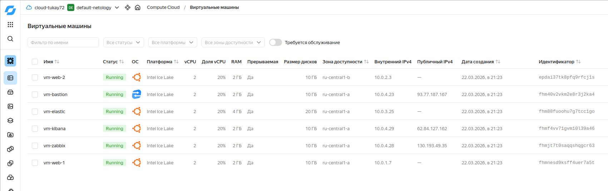

Развернул один VPC. Сервера web, Elasticsearch помещены в приватные подсети. Сервера Zabbix, Kibana, application load balancer определены в публичную подсеть.  
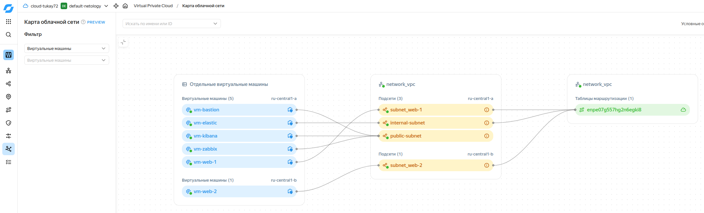

Настроил Security Groups соответствующих сервисов на входящий трафик только к нужным портам.  
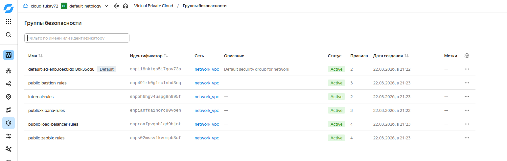

Создал Target Group, включил в неё две созданных ВМ.  
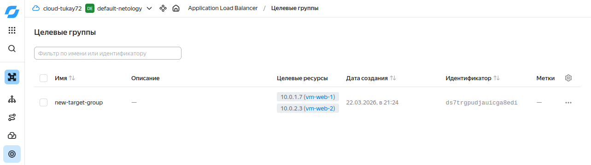

Создал Backend Group, настроил backends на target group, ранее созданную.  
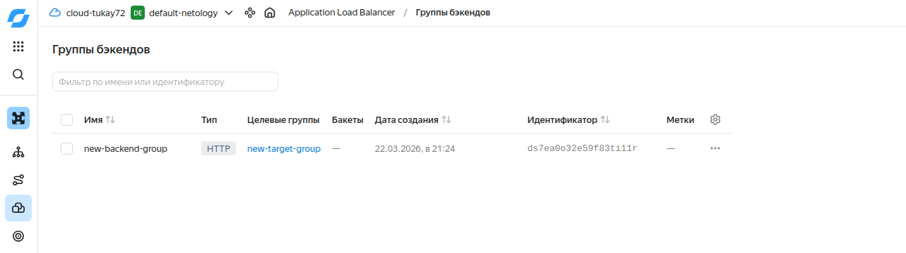

Создал HTTP router.  
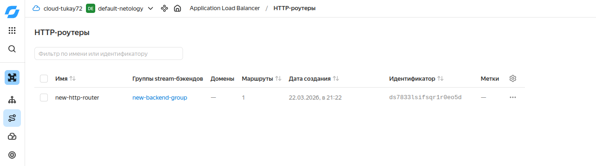

Создал Application load balancer для распределения трафика на веб-сервера, созданные ранее.  
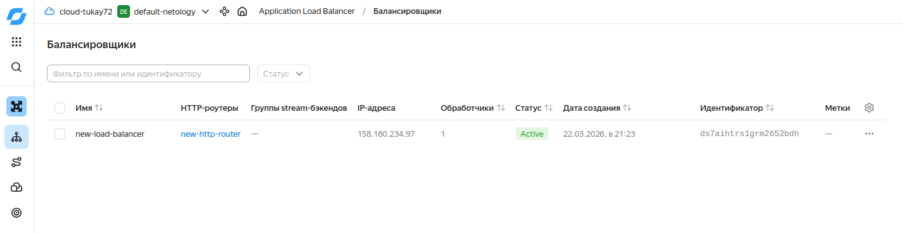

На две машины установил nginx c помощью Ansible:  
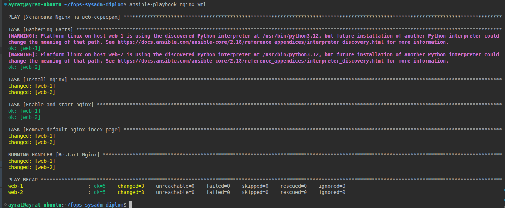

Сайт отвечает по ip адресу балансировщика.  
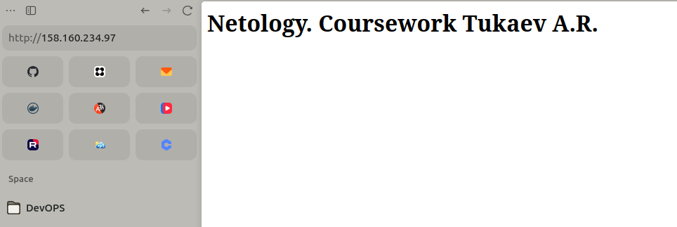

Протестировал командой:
```
curl -v 158.160.234.97:80
```
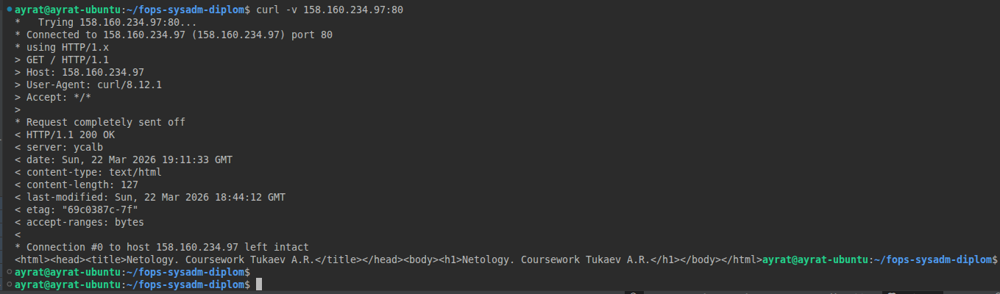

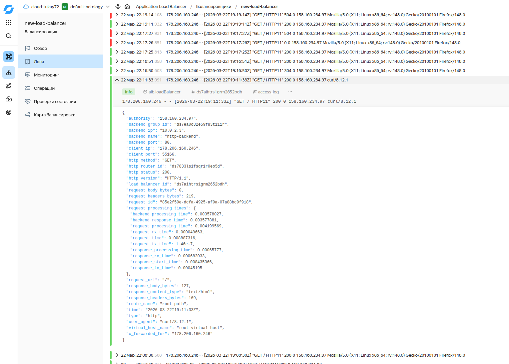

Создал snapshot дисков всех ВМ. На следующий день проверил выполнение.   
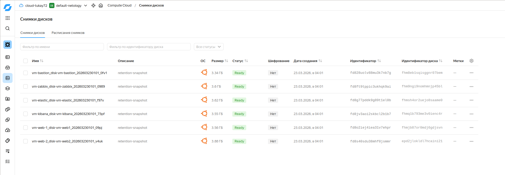

С помощью ansible установил Zabbix на виртуальную машину vm-zabbix.  
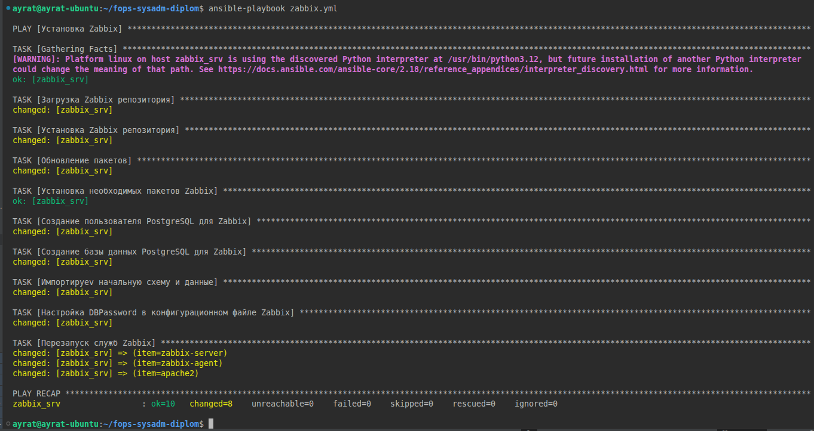

На ВМ web1 и web2 установил Zabbix Agent, настроил агенты на отправление метрик в Zabbix.  
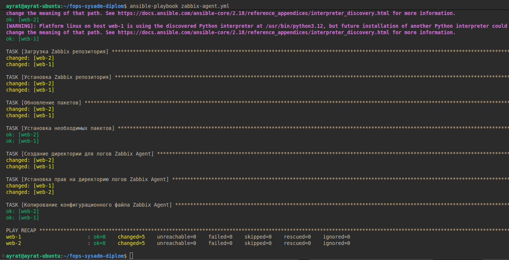

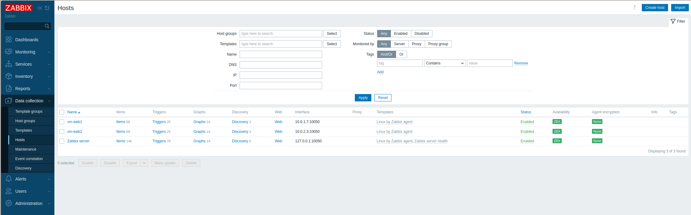

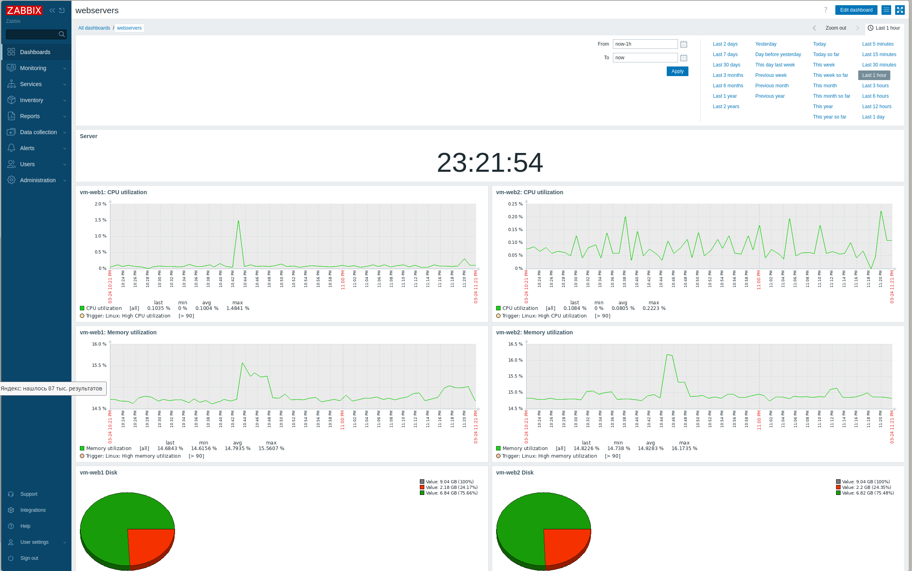

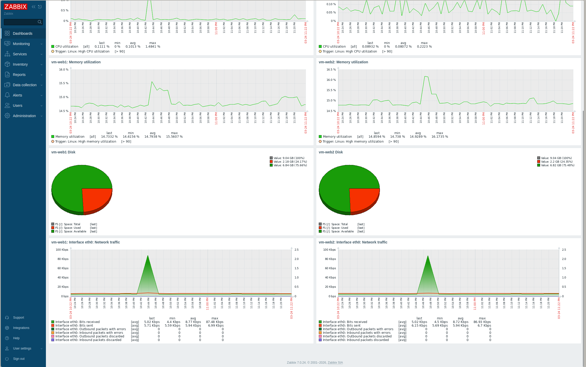

Установил Elasticsearch на vm-elastic.  
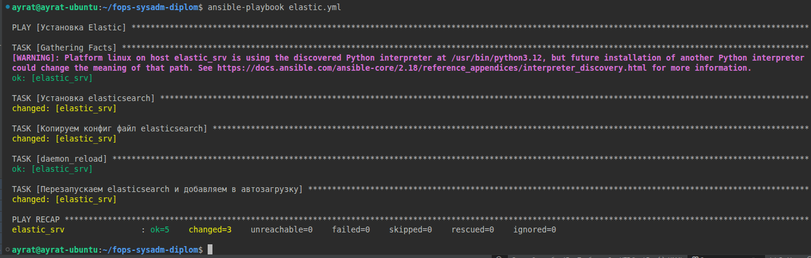

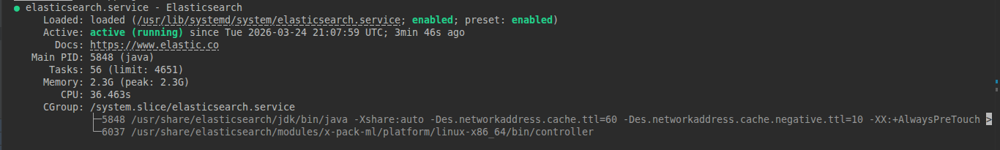

Установил filebeat в ВМ к веб-серверам.  
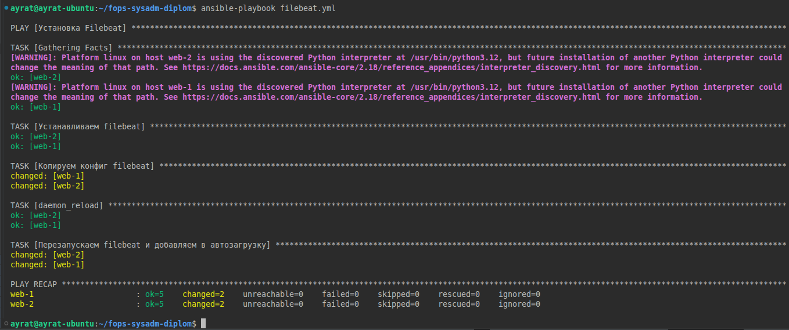

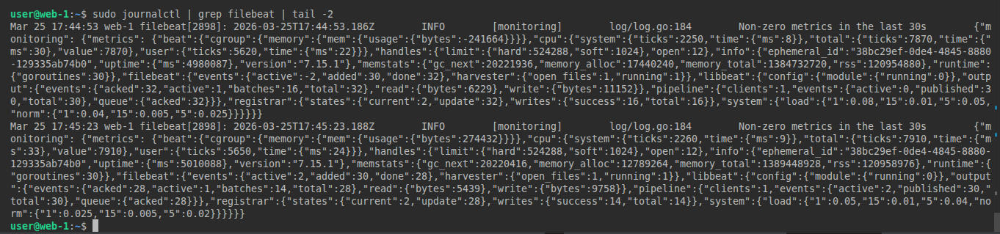

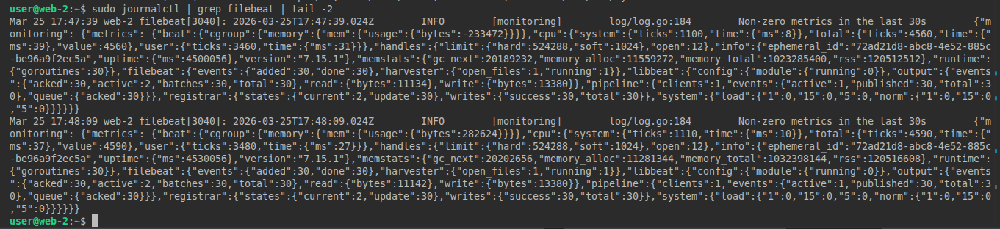

Установил kibana в ВМ vm-kibana.  
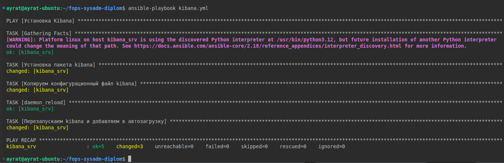

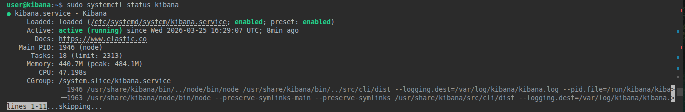

Проверяем в Kibana что Filebeat доставляет логи в Elasticsearch.  

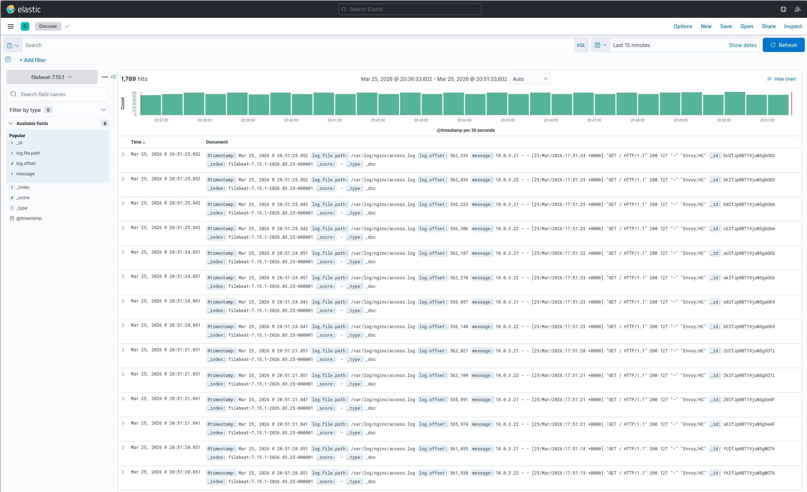


## Для проверки курсовой отключил прерывание виртуальных машин. Изменились публичные ip адреса. 
vm-zabbix   158.160.121.227      имя пользователя: Admin  пароль: zabbix  
vm-kibana   158.160.124.184

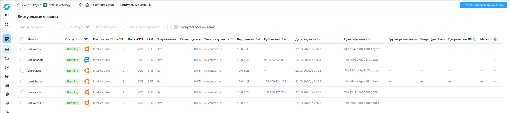